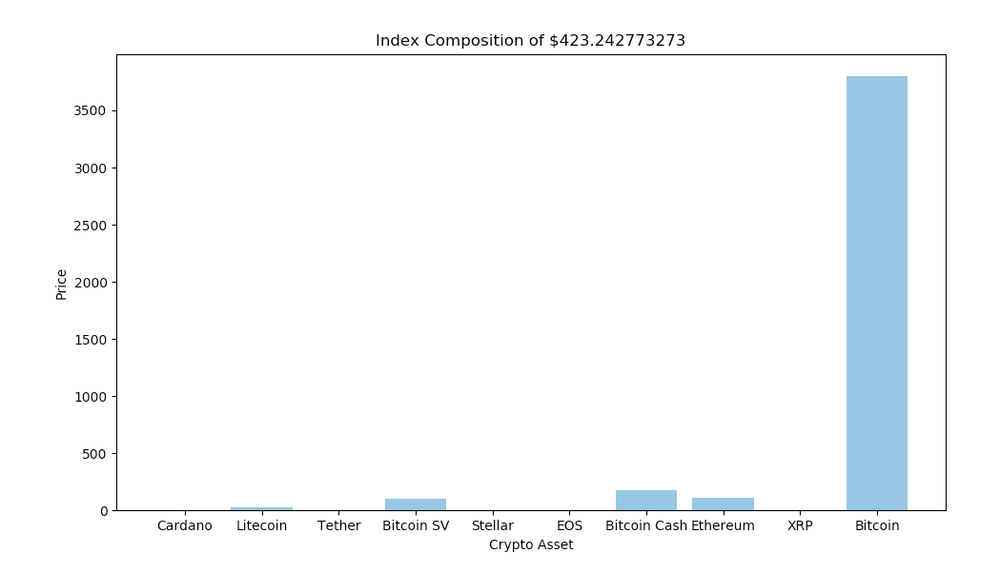
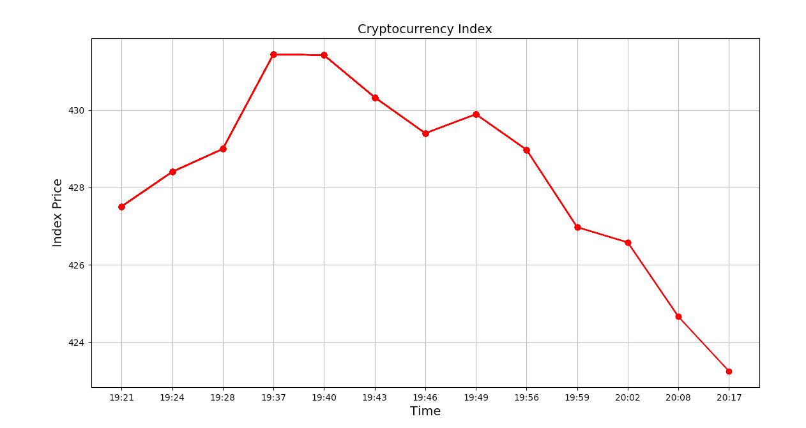

# Cryptocurrency Index
This program allows the user to select the number of cryptocurrencies to include in the `price-weighted index`. 

## Prerequisites
Library to install:
```
coinmarketcap
```
Python version:
```
Python 2.7
```

## Definition
As per `Investopedia`: A price-weighted index is a stock index in which 
each stock influences the index in proportion to its price per share. 
Adding the price of each stock in the index and dividing by the total number of stocks determines the index’s value. 
A stock with a higher price will be given more weight than a stock with a lower price and, 
therefore, will have a greater say in the index’s performance.


The `benefits` of investing in this hypothetical cryptocurrency index are:
- Diversification
- Greater exposure to the market
- Purely passive investing

## Composition
The user is allowed to include from 3 to 20 cryptocurrencies in the index. 
The crypto-assets will be gathered based on the current market capitalization. 


The index is updated every `3 minutes` and the graph will be updated automatically:



## Things to Consider
### Time
```
    index_time_tracking.append(strftime("%H:%M", gmtime()))
```
This grabs `Unix Time Stamp`; however, if current time is needed, use:
```
    index_time_tracking.append((datetime.datetime.now().time()).isoformat())
```
Although this new way of getting time will forgo UTC, it will cause overlays on x-axis in the graph.

### Index Rebalancing
If the market capitalization of crypto-asset changes, the program will notice that. 
In this case, the index composition will be rearranged and only be computed on the next cycle. 
Such implimentation is different from the real-world indcies, where rebalancing often happens quaterly. 

### Index Tracking 
The current index is tracked for one hour. If the time period needs to be prolonged or shortened look at the following block:
```
    i = 0
while i != 19:
    time.sleep(180)
```
